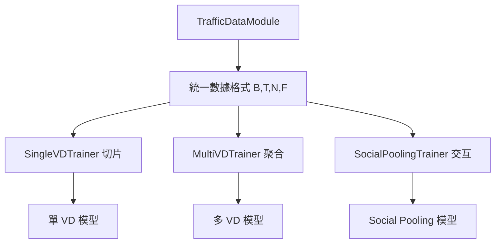
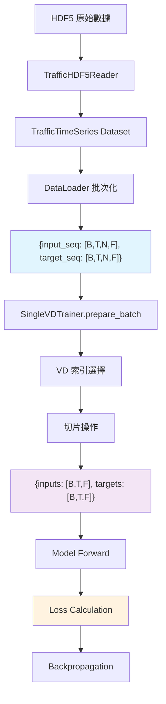

# 數據流程架構設計

> 深入解析 Social-xLSTM 專案的數據處理流程、切片策略與 targets 使用邏輯  
> 解答：為什麼單 VD 訓練需要從多 VD 數據中切片？targets 在整個訓練流程中的作用？

---

## 🎯 核心概念

### 問題背景

在使用 `TrafficDataModule` 進行 without social pooling 訓練時，你可能會疑惑：

1. **為什麼單 VD 訓練要從多 VD 數據中切片？**
2. **targets 在無 social pooling 場景下是否必要？**
3. **為什麼不直接建立單 VD 專用的 DataModule？**

**答案**：這是一個精心設計的**統一數據架構**，實現了高度的模組化和可重用性。

---

## 📊 數據流程全景

### 1. TrafficDataModule 設計哲學

```python
# TrafficDataModule 的核心設計原則：
# "一個通用的 DataModule，支援所有訓練場景"

class TrafficDataModule:
    """
    統一數據模組：
    - 加載完整的多 VD 數據集
    - 提供標準化的 [B, T, N, F] 格式
    - 支援單 VD、多 VD、Social Pooling 等所有場景
    """
```

### 2. 數據格式與維度

**TrafficTimeSeries 輸出**：
```python
# 單個樣本格式
{
    'input_seq': Tensor[seq_len, num_vds, num_features],    # 歷史數據
    'target_seq': Tensor[pred_len, num_vds, num_features],  # 未來數據 (targets)
    'vdids': ['VD-001', 'VD-002', 'VD-003', ...],         # VD 識別碼
    'timestamps': [...],                                    # 時間戳記
    # ... 其他元數據
}

# DataLoader 批次化後
{
    'input_seq': Tensor[B, T, N, F],   # [批次, 時間步, VD數量, 特徵]
    'target_seq': Tensor[B, T, N, F],  # [批次, 預測長度, VD數量, 特徵]
    'vdids': [['VD-001', 'VD-002', ...], ...],  # 每個樣本的 VD 列表
}
```

**B T N F 維度說明**：
- **B** (Batch Size): 批次大小，平行處理的樣本數
- **T** (Time Steps): 時間步長，序列長度或預測長度
- **N** (Number of Nodes): VD 數量，空間維度
- **F** (Feature Dimension): 特徵維度，每個 VD 的特徵向量長度

---

## 🔧 SingleVDTrainer 切片策略

### 核心邏輯：prepare_batch 方法

```python
class SingleVDTrainer:
    def prepare_batch(self, batch):
        """
        將多 VD 數據轉換為單 VD 訓練格式
        
        關鍵設計：
        1. 從 [B, T, N, F] 中選擇特定的 VD (N 維度切片)
        2. 對 inputs 和 targets 進行相同的切片操作
        3. 確保數據一致性和監督學習的完整性
        """
        # 1. 提取多 VD 格式數據
        inputs = batch['input_seq']    # [B, T, N, F] - 多 VD 歷史數據
        targets = batch['target_seq']  # [B, T, N, F] - 多 VD 未來數據
        
        # 2. 確定目標 VD 索引
        vd_idx = self._select_vd_index(batch.get('vdids'))
        
        # 3. 關鍵切片操作
        inputs = inputs[:, :, vd_idx, :]   # [B, T, F] - 單 VD 歷史數據
        targets = targets[:, :, vd_idx, :] # [B, T, F] - 單 VD 未來數據
        
        return inputs, targets
    
    def _select_vd_index(self, vdids):
        """
        VD 選擇邏輯：
        - 如果指定了 select_vd_id，找到對應索引
        - 否則默認使用第一個 VD (索引 0)
        """
        if self.select_vd_id and vdids:
            try:
                return vdids[0].index(self.select_vd_id)
            except (ValueError, IndexError):
                logger.warning(f"VD {self.select_vd_id} not found, using first VD")
                return 0
        return 0
```

### 為什麼這樣設計？

**1. 關注點分離 (Separation of Concerns)**：
```python
# TrafficDataModule: 專注數據加載
class TrafficDataModule:
    責任：高效加載、批次化、規範化數據格式
    輸出：標準 [B, T, N, F] 格式，支援所有訓練場景

# SingleVDTrainer: 專注訓練邏輯
class SingleVDTrainer:
    責任：將通用數據適配到特定訓練需求
    輸入：標準 [B, T, N, F] 格式
    輸出：單 VD 訓練所需的 [B, T, F] 格式
```

**2. 架構靈活性**：
```python
# 同一個 DataModule 支援多種訓練模式
TrafficDataModule → SingleVDTrainer     # 單 VD 訓練
                 → MultiVDTrainer       # 多 VD 訓練  
                 → SocialPoolingTrainer # Social Pooling 訓練
```

**3. 代碼重用性**：
- 避免為每種訓練模式創建專用 DataModule
- 統一的數據預處理、正規化、分割邏輯
- 一致的數據品質保證

---

## 🎯 Targets 的關鍵作用

### 監督學習基本原理

```python
# 訓練循環中的 targets 使用
def training_step(self, batch):
    # 1. 數據準備
    inputs, targets = self.prepare_batch(batch)
    
    # 2. 模型預測
    predictions = self.model(inputs)  # [B, T, F]
    
    # 3. 損失計算 (關鍵：需要 targets)
    loss = self.criterion(predictions, targets)
    
    # 4. 反向傳播
    loss.backward()
    
    return loss
```

### 為什麼 targets 必不可少？

**1. 監督學習核心**：
```python
# 沒有 targets 就無法計算損失
loss = MSE(predictions, targets)  # targets 是真實的未來值
```

**2. 訓練 vs 推論的區別**：
```python
# 訓練階段：有 targets，用於學習
train_data = {
    'inputs': historical_data,   # 過去 12 個時間步
    'targets': future_data       # 未來 1-3 個時間步的真實值
}

# 推論階段：無 targets，進行預測
inference_data = {
    'inputs': historical_data,   # 過去 12 個時間步
    # 沒有 targets，因為未來值未知，正是我們要預測的
}
```

**3. 數據一致性保證**：
```python
# 對稱處理確保正確性
inputs_selected = batch['input_seq'][:, :, vd_idx, :]    # 特定 VD 的歷史
targets_selected = batch['target_seq'][:, :, vd_idx, :]  # 特定 VD 的未來

# 模型學習的是：「給定 VD_A 的歷史，預測 VD_A 的未來」
```

---

## 🏗️ 架構設計優勢

### 1. 模組化設計



### 2. 維護性提升

```python
# 修改數據預處理邏輯時，只需更新一個地方
class TrafficDataModule:
    def _preprocess_data(self):
        # 統一的預處理邏輯
        # 影響所有訓練場景
        pass

# 不需要在多個 DataModule 中重複修改
```

### 3. 測試簡化

```python
# 統一的數據格式測試
def test_data_format():
    datamodule = TrafficDataModule(config)
    batch = next(iter(datamodule.train_dataloader()))
    
    assert batch['input_seq'].shape == (B, T, N, F)
    assert batch['target_seq'].shape == (B, pred_len, N, F)
    
    # 所有 Trainer 都基於這個標準格式
```

---

## 🔄 完整數據流程圖



---

## 🚀 實際使用範例

### 範例 1：單 VD 訓練腳本

```python
# scripts/train/without_social_pooling/train_single_vd.py
def main():
    # 1. 創建統一 DataModule
    data_module = TrafficDataModule(config)  # 加載所有 VD 數據
    
    # 2. 創建單 VD 模型
    model = TrafficLSTM.create_single_vd_model(input_size=3)
    
    # 3. 創建專門的訓練器
    trainer = SingleVDTrainer(
        model=model,
        config=training_config,
        train_loader=data_module.train_dataloader(),  # [B,T,N,F] 格式
        # SingleVDTrainer 內部會自動切片到 [B,T,F]
    )
    
    # 4. 開始訓練
    trainer.train()  # 自動處理切片和 targets
```

### 範例 2：未來擴展到 Social Pooling

```python
# 相同的 DataModule，不同的 Trainer
def train_with_social_pooling():
    # 1. 相同的數據加載
    data_module = TrafficDataModule(config)  # 重用相同邏輯
    
    # 2. Social Pooling 模型
    model = DistributedSocialXLSTMModel(config)
    
    # 3. Social Pooling 訓練器
    trainer = SocialPoolingTrainer(
        model=model,
        train_loader=data_module.train_dataloader(),  # 相同格式
        # SocialPoolingTrainer 使用所有 VD 數據進行交互建模
    )
    
    trainer.train()
```

---

## 📝 關鍵要點總結

### ✅ 設計正確性

1. **統一架構** - 一個 DataModule 支援所有訓練場景
2. **切片策略** - 在 Trainer 層面進行數據適配
3. **Targets 必要** - 監督學習的核心要求
4. **模組分離** - 清晰的職責劃分

### 🎯 實際效益

1. **代碼重用** - 避免重複的數據處理邏輯
2. **維護簡化** - 集中化的數據管理
3. **擴展性強** - 輕鬆添加新的訓練模式
4. **測試統一** - 標準化的數據格式驗證

### ⚠️ 常見誤解

1. **誤解**：「單 VD 訓練不需要多 VD 數據」
   - **正解**：統一格式提供更好的架構靈活性

2. **誤解**：「無 Social Pooling 就不需要 targets」
   - **正解**：targets 是監督學習的基本要求

3. **誤解**：「應該為每種場景建立專用 DataModule」
   - **正解**：統一架構減少重複代碼和維護成本

---

## 🔗 相關文檔

- [datamodule-comparison.md](../technical/datamodule-comparison.md) - 集中式 vs 分散式架構比較
- [mathematical-specifications.md](../technical/mathematical-specifications.md) - 數學規範和維度定義
- [CLAUDE.md](../../CLAUDE.md#-張量維度標準規範) - B T N F 維度標準
- [single_vd_trainer.py](../../src/social_xlstm/training/without_social_pooling/single_vd_trainer.py) - 實際實現代碼

---

**作者**: Social-xLSTM Project Team  
**建立日期**: 2025-08-02  
**版本**: 1.0  
**目的**: 澄清數據流程設計決策，避免架構誤解