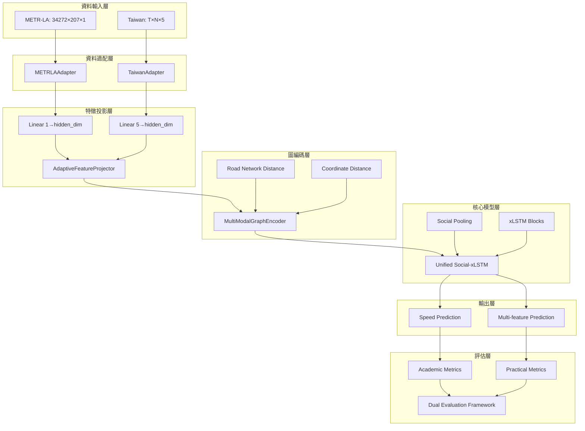

# 雙資料集統一架構實施策略

## 概述

本文檔基於 [ADR-0503](../adr/0503-dual-dataset-architecture-decision.md) 的決策，詳細規劃統一 Social-xLSTM 架構的實施策略，支援 METR-LA 學術基準和台灣交通資料的雙重評估。

## 實施目標

### 核心目標
1. **學術認可**：在 METR-LA 上達到或超越 SOTA 性能
2. **實用價值**：展示台灣多特徵資料的優勢
3. **技術創新**：統一架構處理不同維度輸入的新方法
4. **可擴展性**：為未來其他資料集整合建立基礎

### 成功標準
```
學術標準：METR-LA MAE ≤ 3.00 (15min), 至少top-3 SOTA競爭力
技術標準：統一架構有效性，特徵投影合理性證明
實用標準：台灣資料多特徵顯著優於單特徵baseline
系統標準：完整雙資料集支援，清晰文檔和接口
```

## 整體架構設計

### 系統架構圖



### 核心模組設計

#### 1. 統一入口接口
```python
class UnifiedSocialXLSTM:
    """統一的Social-xLSTM模型，支援多資料集"""
    
    def __init__(self, config):
        self.feature_projector = AdaptiveFeatureProjector(config)
        self.graph_encoder = MultiModalGraphEncoder(config)
        self.social_xlstm_core = SocialXLSTMCore(config)
        
    def forward(self, batch, dataset_name):
        """統一的前向傳播接口"""
        features = batch['features']  # [batch, time, nodes, feat_dim]
        adjacency = batch['adjacency']  # [nodes, nodes]
        
        # 1. 自適應特徵投影
        projected = self.feature_projector(features, dataset_name)
        
        # 2. 圖空間編碼
        graph_encoded = self.graph_encoder(projected, adjacency, dataset_name)
        
        # 3. 核心Social-xLSTM處理
        output = self.social_xlstm_core(graph_encoded)
        
        return output
```

#### 2. 資料集適配器層
```python
# src/social_xlstm/dataset/adapters/base.py
class BaseTrafficAdapter(ABC):
    """交通資料集適配器基類"""
    
    @abstractmethod
    def load_data(self) -> Dict[str, torch.Tensor]:
        """載入原始資料"""
        pass
        
    @abstractmethod
    def get_adjacency_matrix(self) -> torch.Tensor:
        """獲取鄰接矩陣"""
        pass
        
    @abstractmethod
    def get_metadata(self) -> Dict[str, Any]:
        """獲取資料集元資訊"""
        pass
        
    @abstractmethod
    def create_dataloaders(self, batch_size: int) -> Dict[str, DataLoader]:
        """創建資料載入器"""
        pass

# src/social_xlstm/dataset/adapters/metr_la.py
class METRLAAdapter(BaseTrafficAdapter):
    """METR-LA資料集適配器"""
    
    def __init__(self, data_path: str, adj_path: str):
        self.data_path = data_path
        self.adj_path = adj_path
        self.config = {
            'name': 'METR-LA',
            'input_dim': 1,
            'num_nodes': 207,
            'graph_method': 'knn',
            'temporal_resolution': '5min'
        }
    
    def load_data(self) -> Dict[str, torch.Tensor]:
        """載入METR-LA HDF5資料"""
        import h5py
        with h5py.File(self.data_path, 'r') as f:
            # Shape: [34272, 207] -> [34272, 207, 1]
            data = torch.FloatTensor(f['speed'][:]).unsqueeze(-1)
        
        return {
            'features': data,
            'timestamps': self._generate_timestamps(),
            'node_ids': [f'sensor_{i}' for i in range(207)]
        }
    
    def get_adjacency_matrix(self) -> torch.Tensor:
        """載入道路網絡距離矩陣並轉換為鄰接矩陣"""
        distances = pd.read_csv(self.adj_path)
        # 轉換為鄰接矩陣（K近鄰）
        return self._distance_to_adjacency(distances, method='knn', k=10)

# src/social_xlstm/dataset/adapters/taiwan.py  
class TaiwanAdapter(BaseTrafficAdapter):
    """台灣交通資料適配器"""
    
    def __init__(self, h5_path: str):
        self.h5_path = h5_path
        self.config = {
            'name': 'Taiwan',
            'input_dim': 5,
            'graph_method': 'threshold',
            'temporal_resolution': '5min'
        }
    
    def load_data(self) -> Dict[str, torch.Tensor]:
        """載入台灣HDF5資料"""
        from social_xlstm.dataset.storage.h5_reader import TrafficHDF5Reader
        
        reader = TrafficHDF5Reader(self.h5_path)
        data = reader.load_features()  # [T, N, 5]
        metadata = reader.get_metadata()
        
        return {
            'features': torch.FloatTensor(data),
            'timestamps': metadata['timestamps'],
            'node_ids': metadata['vdids'],
            'feature_names': metadata['feature_names']
        }
    
    def get_adjacency_matrix(self) -> torch.Tensor:
        """基於VD座標生成鄰接矩陣"""
        vd_coordinates = self._load_vd_coordinates()
        return self._coordinate_to_adjacency(vd_coordinates, threshold_km=5.0)
```

#### 3. 自適應特徵投影層
```python
# src/social_xlstm/models/feature_projector.py
class AdaptiveFeatureProjector(nn.Module):
    """自適應特徵投影層，處理不同維度輸入"""
    
    def __init__(self, config: Dict[str, Any]):
        super().__init__()
        hidden_dim = config['hidden_dim']
        
        # 為每個資料集定義專用投影層
        self.projectors = nn.ModuleDict()
        
        for dataset_name, dataset_config in config['datasets'].items():
            input_dim = dataset_config['input_dim']
            self.projectors[dataset_name] = nn.Sequential(
                nn.Linear(input_dim, hidden_dim),
                nn.LayerNorm(hidden_dim),
                nn.ReLU(),
                nn.Dropout(config.get('dropout', 0.1))
            )
    
    def forward(self, x: torch.Tensor, dataset_name: str) -> torch.Tensor:
        """
        Args:
            x: [batch, time, nodes, input_dim]
            dataset_name: 'metr_la' or 'taiwan'
        Returns:
            projected: [batch, time, nodes, hidden_dim]
        """
        if dataset_name not in self.projectors:
            raise ValueError(f"Unknown dataset: {dataset_name}")
            
        return self.projectors[dataset_name](x)
```

#### 4. 多模態圖編碼器
```python
# src/social_xlstm/models/graph_encoder.py
class MultiModalGraphEncoder(nn.Module):
    """統一的圖編碼器，處理不同類型的空間關係"""
    
    def __init__(self, config: Dict[str, Any]):
        super().__init__()
        self.config = config
        
    def build_adjacency(self, distances: torch.Tensor, 
                       method: str, **kwargs) -> torch.Tensor:
        """根據不同方法建構鄰接矩陣"""
        
        if method == 'knn':
            # METR-LA: K近鄰基於道路網絡距離
            k = kwargs.get('k', 10)
            return self._knn_adjacency(distances, k)
            
        elif method == 'threshold':
            # Taiwan: 閾值基於地理座標距離
            threshold = kwargs.get('threshold_km', 5.0)
            return self._threshold_adjacency(distances, threshold)
            
        else:
            raise ValueError(f"Unknown adjacency method: {method}")
    
    def _knn_adjacency(self, distances: torch.Tensor, k: int) -> torch.Tensor:
        """K近鄰鄰接矩陣"""
        # 找到每個節點的k個最近鄰居
        _, indices = distances.topk(k, dim=-1, largest=False)
        
        # 構建對稱的鄰接矩陣
        num_nodes = distances.size(0)
        adj = torch.zeros_like(distances)
        
        for i in range(num_nodes):
            adj[i, indices[i]] = 1.0
            adj[indices[i], i] = 1.0  # 確保對稱性
            
        return self._normalize_adjacency(adj)
    
    def _threshold_adjacency(self, distances: torch.Tensor, 
                           threshold: float) -> torch.Tensor:
        """閾值鄰接矩陣"""
        # 距離小於閾值的節點認為相鄰
        adj = (distances <= threshold).float()
        
        # 移除自環
        adj.fill_diagonal_(0)
        
        return self._normalize_adjacency(adj)
    
    def _normalize_adjacency(self, adj: torch.Tensor) -> torch.Tensor:
        """對稱歸一化鄰接矩陣 D^(-1/2) A D^(-1/2)"""
        # 計算度矩陣
        degree = adj.sum(dim=1)
        degree_inv_sqrt = torch.pow(degree + 1e-8, -0.5)
        
        # 對稱歸一化
        norm_adj = degree_inv_sqrt.unsqueeze(1) * adj * degree_inv_sqrt.unsqueeze(0)
        
        return norm_adj
```

#### 5. 統一核心模型
```python
# src/social_xlstm/models/unified_social_xlstm.py
class SocialXLSTMCore(nn.Module):
    """統一的Social-xLSTM核心，與資料集無關"""
    
    def __init__(self, config: Dict[str, Any]):
        super().__init__()
        
        hidden_dim = config['hidden_dim']
        num_layers = config['num_layers']
        
        # Social Pooling層
        self.social_pooling = SocialPoolingLayer(
            hidden_dim=hidden_dim,
            pool_size=config.get('pool_size', 3),
            distance_threshold=config.get('distance_threshold', 2.0)
        )
        
        # xLSTM塊堆疊
        self.xlstm_blocks = nn.ModuleList([
            xLSTMBlock(
                hidden_dim=hidden_dim,
                num_heads=config.get('num_heads', 8),
                dropout=config.get('dropout', 0.1)
            ) for _ in range(num_layers)
        ])
        
        # 輸出投影層
        self.output_projection = nn.Linear(hidden_dim, config['output_dim'])
        
    def forward(self, x: torch.Tensor, adjacency: torch.Tensor) -> torch.Tensor:
        """
        Args:
            x: [batch, time, nodes, hidden_dim]
            adjacency: [nodes, nodes]
        Returns:
            output: [batch, time, nodes, output_dim]
        """
        batch_size, seq_len, num_nodes, hidden_dim = x.shape
        
        # Social Pooling - 空間資訊聚合
        pooled = self.social_pooling(x, adjacency)
        
        # xLSTM - 時間序列建模
        lstm_input = pooled.view(batch_size * num_nodes, seq_len, hidden_dim)
        
        for xlstm_block in self.xlstm_blocks:
            lstm_input = xlstm_block(lstm_input)
        
        # 重新整形並輸出投影
        lstm_output = lstm_input.view(batch_size, seq_len, num_nodes, hidden_dim)
        output = self.output_projection(lstm_output)
        
        return output
```

## 階段性實施計畫

### Phase 1: 基礎架構實現 (第1-2週)

#### 1.1 資料集適配器實現
**目標**：建立統一的資料載入接口

**任務**：
- [ ] 實現 `BaseTrafficAdapter` 抽象基類
- [ ] 實現 `METRLAAdapter` - METR-LA資料載入
- [ ] 實現 `TaiwanAdapter` - 台灣資料載入
- [ ] 測試資料載入和格式轉換

**驗收標準**：
```python
# 統一的資料載入接口
metr_la = METRLAAdapter("data/metr-la.h5", "data/distances_la_2012.csv")
taiwan = TaiwanAdapter("blob/dataset/h5/traffic_features.h5")

# 相同的接口調用
metr_data = metr_la.load_data()    # [34272, 207, 1]
taiwan_data = taiwan.load_data()   # [T, N, 5]

assert metr_data['features'].shape[-1] == 1
assert taiwan_data['features'].shape[-1] == 5
```

#### 1.2 特徵投影層實現
**目標**：統一不同維度的特徵輸入

**任務**：
- [ ] 實現 `AdaptiveFeatureProjector` 類
- [ ] 支援動態資料集註冊
- [ ] 添加可學習的特徵權重
- [ ] 實現投影層的可視化分析

**驗收標準**：
```python
projector = AdaptiveFeatureProjector(config)

# 不同維度輸入，相同維度輸出
metr_input = torch.randn(32, 12, 207, 1)    # METR-LA格式
taiwan_input = torch.randn(32, 12, 50, 5)   # 台灣格式

metr_output = projector(metr_input, 'metr_la')     # [32, 12, 207, hidden_dim]
taiwan_output = projector(taiwan_input, 'taiwan')  # [32, 12, 50, hidden_dim]

assert metr_output.shape[-1] == taiwan_output.shape[-1]
```

#### 1.3 圖編碼器實現
**目標**：統一空間關係建模

**任務**：
- [ ] 實現 `MultiModalGraphEncoder` 類
- [ ] K近鄰鄰接矩陣生成（METR-LA）
- [ ] 閾值鄰接矩陣生成（Taiwan）
- [ ] 對稱歸一化實現

**驗收標準**：
```python
encoder = MultiModalGraphEncoder(config)

# 不同的距離輸入，統一的鄰接矩陣輸出
road_distances = load_metr_la_distances()    # 道路網絡距離
geo_distances = load_taiwan_coordinates()    # 地理座標距離

adj_knn = encoder.build_adjacency(road_distances, 'knn', k=10)
adj_threshold = encoder.build_adjacency(geo_distances, 'threshold', threshold_km=5.0)

assert adj_knn.shape[0] == adj_knn.shape[1]  # 對稱矩陣
assert adj_threshold.shape[0] == adj_threshold.shape[1]
```

### Phase 2: METR-LA基準驗證 (第3週)

#### 2.1 METR-LA標準實現
**目標**：在METR-LA上複現基準結果

**任務**：
- [ ] 實現標準的70/10/20資料分割
- [ ] 實現15/30/60分鐘預測評估
- [ ] 標準評估指標（MAE, RMSE, MAPE）
- [ ] 與已發表結果比較

**性能目標**：
```
指標           15min   30min   60min
目標MAE        ≤3.00   ≤3.90   ≤4.60
SOTA基準       2.96    3.84    4.49  (TITAN)
可接受範圍     ≤3.20   ≤4.20   ≤5.00
```

#### 2.2 模型超參數優化
**目標**：針對METR-LA優化模型性能

**任務**：
- [ ] 網格搜索關鍵超參數
- [ ] 學習率調度策略優化
- [ ] Early stopping和模型保存
- [ ] 多次運行的穩定性測試

**優化範圍**：
```yaml
hyperparameters:
  hidden_dim: [64, 128, 256]
  num_layers: [2, 3, 4]
  learning_rate: [0.001, 0.0005, 0.0001]
  dropout: [0.1, 0.2, 0.3]
  social_pool_size: [3, 5, 7]
```

#### 2.3 基準比較和分析
**目標**：與SOTA模型進行公平比較

**任務**：
- [ ] 實現相同的實驗設置
- [ ] 統計顯著性測試
- [ ] 計算效率比較
- [ ] 錯誤分析和案例研究

### Phase 3: 台灣資料整合 (第4週)

#### 3.1 台灣資料適配
**目標**：成功整合台灣多特徵資料

**任務**：
- [ ] 台灣資料的預處理和清理
- [ ] 多特徵歸一化策略
- [ ] 時間分割和驗證設計
- [ ] VD座標鄰接矩陣生成

#### 3.2 多特徵優勢驗證
**目標**：證明多特徵的統計顯著優勢

**任務**：
- [ ] 5特徵 vs 單速度特徵對比
- [ ] 特徵重要性分析
- [ ] Ablation study設計和執行
- [ ] 交通基本圖一致性驗證

**預期結果**：
```
配置                     MAE      改善幅度
單特徵(僅速度)           X        baseline
雙特徵(速度+流量)        0.9X     10%↑
三特徵(+佔有率)          0.85X    15%↑  
五特徵(完整)             0.8X     20%↑
```

#### 3.3 跨資料集分析
**目標**：發現跨資料集的通用規律

**任務**：
- [ ] 統一架構在兩個資料集上的表現
- [ ] 特徵投影權重分析
- [ ] 模型可解釋性研究
- [ ] 遷移學習潛力探索

### Phase 4: 評估框架和文檔 (第5週)

#### 4.1 雙重評估框架
**目標**：建立完整的評估體系

**任務**：
- [ ] 學術指標自動計算和報告
- [ ] 實用指標設計和實現
- [ ] 結果可視化和比較
- [ ] 自動化基準測試

#### 4.2 系統整合和測試
**目標**：確保系統的穩定性和可用性

**任務**：
- [ ] 端到端整合測試
- [ ] 性能測試和瓶頸分析
- [ ] 記憶體和計算資源監控
- [ ] 錯誤處理和異常恢復

#### 4.3 文檔和使用指南
**目標**：提供完整的使用文檔

**任務**：
- [ ] API文檔生成
- [ ] 使用者指南編寫
- [ ] 實驗復現指南
- [ ] 論文實驗結果組織

## 配置管理

### 統一配置格式

```yaml
# cfgs/datasets/unified.yaml
model:
  name: "UnifiedSocialXLSTM"
  hidden_dim: 128
  num_layers: 3
  dropout: 0.1
  social_pool_size: 5

datasets:
  metr_la:
    input_dim: 1
    num_nodes: 207
    graph_method: "knn"
    knn_k: 10
    data_path: "data/metr-la.h5"
    adj_path: "data/distances_la_2012.csv"
    
  taiwan:
    input_dim: 5
    graph_method: "threshold"
    threshold_km: 5.0
    data_path: "blob/dataset/h5/traffic_features.h5"
    feature_names: ["avg_speed", "total_volume", "avg_occupancy", "speed_std", "lane_count"]

training:
  batch_size: 32
  learning_rate: 0.001
  max_epochs: 200
  early_stopping_patience: 10
  
evaluation:
  academic_metrics: ["MAE", "RMSE", "MAPE"]
  practical_metrics: ["accuracy", "timeliness", "reliability"]
  prediction_horizons: [15, 30, 60]  # minutes
```

### Snakemake工作流程

```python
# Snakefile updates
rule train_unified_model:
    input:
        config="cfgs/datasets/unified.yaml"
    params:
        dataset="{dataset}"  # metr_la or taiwan
    output:
        model="models/unified_social_xlstm_{dataset}.pt",
        metrics="results/metrics_{dataset}.json"
    shell:
        """
        python scripts/train_unified.py \
            --config {input.config} \
            --dataset {params.dataset} \
            --output_model {output.model} \
            --output_metrics {output.metrics}
        """

rule evaluate_cross_dataset:
    input:
        metr_model="models/unified_social_xlstm_metr_la.pt",
        taiwan_model="models/unified_social_xlstm_taiwan.pt"
    output:
        report="results/cross_dataset_analysis.html"
    shell:
        """
        python scripts/cross_dataset_evaluation.py \
            --metr_model {input.metr_model} \
            --taiwan_model {input.taiwan_model} \
            --output {output.report}
        """
```

## 測試策略

### 單元測試

```python
# tests/test_feature_projector.py
class TestAdaptiveFeatureProjector:
    def test_metr_la_projection(self):
        """測試METR-LA特徵投影"""
        projector = AdaptiveFeatureProjector(config)
        x = torch.randn(8, 12, 207, 1)
        output = projector(x, 'metr_la')
        assert output.shape == (8, 12, 207, 128)
        
    def test_taiwan_projection(self):
        """測試台灣資料特徵投影"""
        projector = AdaptiveFeatureProjector(config)
        x = torch.randn(8, 12, 50, 5)
        output = projector(x, 'taiwan')
        assert output.shape == (8, 12, 50, 128)
        
    def test_gradient_flow(self):
        """測試梯度流動"""
        projector = AdaptiveFeatureProjector(config)
        x = torch.randn(2, 4, 10, 5, requires_grad=True)
        output = projector(x, 'taiwan')
        loss = output.sum()
        loss.backward()
        assert x.grad is not None

# tests/test_graph_encoder.py
class TestMultiModalGraphEncoder:
    def test_knn_adjacency(self):
        """測試K近鄰鄰接矩陣"""
        encoder = MultiModalGraphEncoder(config)
        distances = torch.randn(10, 10)
        adj = encoder.build_adjacency(distances, 'knn', k=3)
        assert adj.shape == (10, 10)
        assert torch.allclose(adj, adj.T)  # 對稱性
        
    def test_threshold_adjacency(self):
        """測試閾值鄰接矩陣"""
        encoder = MultiModalGraphEncoder(config)
        distances = torch.rand(10, 10) * 10  # 0-10的距離
        adj = encoder.build_adjacency(distances, 'threshold', threshold=5.0)
        assert adj.shape == (10, 10)
        assert adj.diagonal().sum() == 0  # 無自環
```

### 整合測試

```python
# tests/integration/test_end_to_end.py
class TestEndToEndFlow:
    def test_metr_la_pipeline(self):
        """測試METR-LA完整流程"""
        # 資料載入
        adapter = METRLAAdapter(data_path, adj_path)
        data = adapter.load_data()
        
        # 模型訓練
        model = UnifiedSocialXLSTM(config)
        trainer = ModelTrainer(model, config)
        trainer.train(data)
        
        # 評估
        evaluator = AcademicEvaluator()
        metrics = evaluator.evaluate(model, data)
        
        assert metrics['MAE'] < 5.0  # 合理的性能閾值
        
    def test_taiwan_pipeline(self):
        """測試台灣資料完整流程"""
        # Similar test for Taiwan data
        pass
        
    def test_unified_training(self):
        """測試統一訓練流程"""
        # Test training on both datasets with same model
        pass
```

### 性能測試

```python
# tests/performance/test_benchmarks.py
class TestPerformanceBenchmarks:
    def test_training_speed(self):
        """測試訓練速度"""
        model = UnifiedSocialXLSTM(config)
        data = create_dummy_data(batch_size=32, seq_len=12)
        
        start_time = time.time()
        for _ in range(100):
            output = model(data['features'], data['adjacency'], 'taiwan')
            loss = output.sum()
            loss.backward()
        end_time = time.time()
        
        avg_time_per_batch = (end_time - start_time) / 100
        assert avg_time_per_batch < 0.1  # 100ms per batch
        
    def test_memory_usage(self):
        """測試記憶體使用"""
        import psutil
        import os
        
        process = psutil.Process(os.getpid())
        initial_memory = process.memory_info().rss / 1024 / 1024  # MB
        
        model = UnifiedSocialXLSTM(config)
        data = create_large_data(batch_size=64)
        output = model(data['features'], data['adjacency'], 'taiwan')
        
        final_memory = process.memory_info().rss / 1024 / 1024  # MB
        memory_increase = final_memory - initial_memory
        
        assert memory_increase < 2000  # Less than 2GB increase
```

## 錯誤處理和日誌

### 統一錯誤處理

```python
# src/social_xlstm/utils/exceptions.py
class SocialXLSTMError(Exception):
    """基礎異常類"""
    pass

class DatasetError(SocialXLSTMError):
    """資料集相關錯誤"""
    pass

class ModelError(SocialXLSTMError):
    """模型相關錯誤"""
    pass

class ConfigurationError(SocialXLSTMError):
    """配置相關錯誤"""
    pass

# src/social_xlstm/utils/logger.py
class UnifiedLogger:
    def __init__(self, name: str, level: str = "INFO"):
        self.logger = logging.getLogger(name)
        self.logger.setLevel(getattr(logging, level))
        
    def log_experiment_start(self, dataset: str, config: Dict):
        self.logger.info(f"Starting experiment on {dataset}")
        self.logger.info(f"Configuration: {config}")
        
    def log_metrics(self, phase: str, metrics: Dict):
        self.logger.info(f"{phase} metrics: {metrics}")
        
    def log_error(self, error: Exception, context: str):
        self.logger.error(f"Error in {context}: {str(error)}")
        self.logger.error(traceback.format_exc())
```

## 部署和維護

### 模型版本管理

```python
# src/social_xlstm/utils/model_versioning.py
class ModelVersionManager:
    def __init__(self, base_dir: str = "models/"):
        self.base_dir = Path(base_dir)
        
    def save_model(self, model: nn.Module, dataset: str, 
                   version: str, metrics: Dict):
        """保存模型和相關元資訊"""
        model_dir = self.base_dir / dataset / version
        model_dir.mkdir(parents=True, exist_ok=True)
        
        # 保存模型權重
        torch.save(model.state_dict(), model_dir / "model.pt")
        
        # 保存配置和指標
        with open(model_dir / "config.json", 'w') as f:
            json.dump(model.config, f, indent=2)
            
        with open(model_dir / "metrics.json", 'w') as f:
            json.dump(metrics, f, indent=2)
    
    def load_model(self, dataset: str, version: str = "latest"):
        """載入指定版本的模型"""
        if version == "latest":
            version = self._get_latest_version(dataset)
            
        model_dir = self.base_dir / dataset / version
        
        # 載入配置
        with open(model_dir / "config.json", 'r') as f:
            config = json.load(f)
            
        # 創建模型並載入權重
        model = UnifiedSocialXLSTM(config)
        model.load_state_dict(torch.load(model_dir / "model.pt"))
        
        return model, config
```

### 監控和警報

```python
# src/social_xlstm/utils/monitoring.py
class ExperimentMonitor:
    def __init__(self, config: Dict):
        self.config = config
        self.metrics_history = []
        
    def track_training(self, epoch: int, metrics: Dict):
        """追蹤訓練過程"""
        self.metrics_history.append({
            'epoch': epoch,
            'timestamp': datetime.now(),
            **metrics
        })
        
        # 檢查異常指標
        self._check_training_health(metrics)
        
    def _check_training_health(self, metrics: Dict):
        """檢查訓練健康狀況"""
        if metrics.get('loss', float('inf')) > 100:
            self._send_alert("Training loss is too high")
            
        if metrics.get('MAE', float('inf')) > 10:
            self._send_alert("MAE is unexpectedly high")
            
    def _send_alert(self, message: str):
        """發送警報"""
        logger.warning(f"ALERT: {message}")
        # 可以擴展為郵件、Slack等通知
```

## 成果驗收

### 階段驗收標準

**Phase 1 驗收**：
- [ ] 所有適配器單元測試通過
- [ ] 特徵投影層正確處理不同維度
- [ ] 圖編碼器生成有效鄰接矩陣
- [ ] 整合測試無錯誤

**Phase 2 驗收**：
- [ ] METR-LA MAE ≤ 3.20 (可接受範圍)
- [ ] 與至少3個SOTA模型比較
- [ ] 訓練穩定性驗證
- [ ] 性能指標文檔完整

**Phase 3 驗收**：
- [ ] 台灣資料成功載入和處理
- [ ] 5特徵顯著優於單特徵(p<0.05)
- [ ] 跨資料集分析有意義結果
- [ ] 統一架構有效性證明

**Phase 4 驗收**：
- [ ] 完整的雙重評估框架
- [ ] 自動化測試流程
- [ ] 使用者文檔齊全
- [ ] 論文實驗結果就緒

### 最終交付物

1. **技術交付**：
   - 完整的統一Social-xLSTM實現
   - 雙資料集支援的適配器系統
   - 自動化評估和比較框架

2. **學術交付**：
   - METR-LA基準競爭性結果
   - 台灣多特徵優勢證明
   - 跨資料集分析洞察

3. **文檔交付**：
   - 完整的API文檔
   - 實驗復現指南
   - 論文實驗結果組織

4. **系統交付**：
   - 可部署的訓練和評估流程
   - 配置管理和版本控制
   - 監控和維護工具

## 風險緩解

### 技術風險緩解

1. **METR-LA性能風險**：
   - 預留充足的超參數調優時間
   - 參考多篇SOTA論文的實現細節
   - 建立性能基準的漸進目標

2. **特徵投影風險**：
   - 設計多種投影策略並比較
   - 實現可解釋性分析工具
   - 建立詳細的ablation study

3. **系統複雜度風險**：
   - 採用模組化設計原則
   - 建立充分的單元測試覆蓋
   - 實現漸進式開發和驗證

### 時程風險緩解

1. **開發延遲風險**：
   - 設定階段性里程碑
   - 建立每日進度追蹤
   - 準備備選方案

2. **調試時間風險**：
   - 提前建立測試框架
   - 實現詳細的日誌和監控
   - 準備調試工具和可視化

## 長期維護計畫

### 擴展性考量

1. **新資料集整合**：
   - 標準化的適配器接口
   - 可配置的特徵投影機制
   - 通用的圖編碼策略

2. **模型升級**：
   - 版本化的模型管理
   - 向後相容性保證
   - 平滑的升級路徑

3. **性能優化**：
   - 持續的性能監控
   - 瓶頸識別和優化
   - 硬體加速支援

### 社群貢獻

1. **開源準備**：
   - 清理代碼和文檔
   - 建立貢獻者指南
   - 設定問題追蹤系統

2. **學術影響**：
   - 論文發表和推廣
   - 會議演講和示範
   - 社群反饋收集和整合

通過這個全面的實施策略，我們將建立一個既有學術認可度又有實用價值的雙資料集Social-xLSTM系統，實現「Best of Both Worlds」的目標。